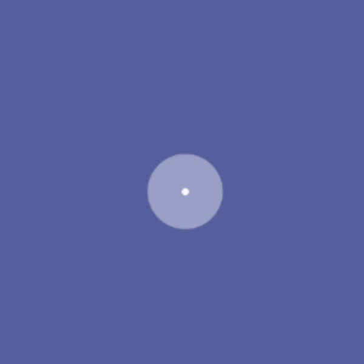

# Beautiful Compose Multiplatform Loading Animations

KLoading is a **Compose Multiplatform** library offering a collection of beautiful and customizable loading animations. Easily implement loading states across **Android, iOS, Desktop, and Web**.

## 🚀 Installation

To integrate KLoading into your Compose Multiplatform project, you need to add the library as a dependency in your `build.gradle.kts` file (typically located in the common source set).

### 1\. Add the Dependency

In your common module's `build.gradle.kts`:

```kotlin
commonMain.dependencies {
    // Other dependencies...
    implementation("io.github.rhobus:KLoading:1.0.0")
}
```

### 2\. Configure Repositories (If Needed)

Ensure your project has access to the Maven Central repository where the library is hosted. This is usually configured in the top-level or project-level `settings.gradle.kts` or `build.gradle.kts`.

## ✨ Animations Available

KLoading currently offers a variety of compelling animations. Each one is a `@Composable` function that can be customized with parameters like `color`, `size`, and animation duration.

<table>
  <tr>
    <th style="text-align:center; width:150px;">BarsWave</th>
    <th style="text-align:center; width:150px;">BricksAnimation</th>
    <th style="text-align:center; width:150px;">DotSpinner</th>
  </tr>
  <tr>
    <td style="text-align:center;"></td>
    <td style="text-align:center;"></td>
    <td style="text-align:center;"></td>
  </tr>

  <tr>
    <th style="text-align:center;">RotatingBricks</th>
    <th style="text-align:center;">RotatingSquare</th>
    <th style="text-align:center;">SonarWave</th>
  </tr>
  <tr>
    <td style="text-align:center;"></td>
    <td style="text-align:center;"></td>
    <td style="text-align:center;"></td>
  </tr>

  <tr>
    <th style="text-align:center;">ThreeDotsWave</th>
    <th style="text-align:center;">WatchRunningAnimation</th>
    <th style="text-align:center;">WatchTickingAnimation</th>
  </tr>
  <tr>
    <td style="text-align:center;"></td>
    <td style="text-align:center;"></td>
    <td style="text-align:center;"></td>
  </tr>
</table>

-----

## 💻 Usage Example

All animations are regular Composable functions. Simply call them in your UI code\!

```kotlin
import androidx.compose.foundation.layout.fillMaxSize
import androidx.compose.material3.MaterialTheme
import androidx.compose.material3.Surface
import androidx.compose.runtime.Composable
import androidx.compose.ui.Modifier
import androidx.compose.ui.graphics.Color
import androidx.compose.ui.unit.dp
import io.github.rhobus.kloading.animation.DotSpinner

@Composable
fun LoadingScreen() {
    Surface(
        modifier = Modifier.fillMaxSize(),
        color = MaterialTheme.colorScheme.primary // Use a contrasting background
    ) {
        DotSpinner(
            color = Color.Yellow,
            dotSize = 10.dp,
            maxRadius = 30.dp
        )
    }
}
```

-----

## 🤝 Contributing

All contributions from the community are welcome\! If you have a cool, performant loading animation you'd like to share, please check out the **[CONTRIBUTING.md](CONTRIBUTING.md)** file for guidelines on how to submit your work. Help us make KLoading the best library for loading animations\!

-----

## 📄 License

KLoading is licensed under the **Apache License, Version 2.0**. You are free to use, modify, and distribute this software, subject to the terms of the license.
