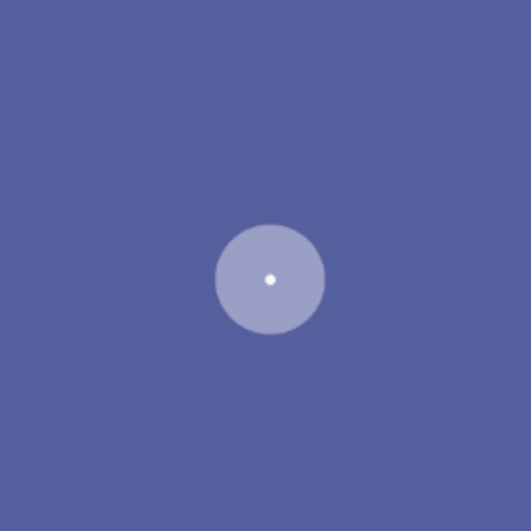
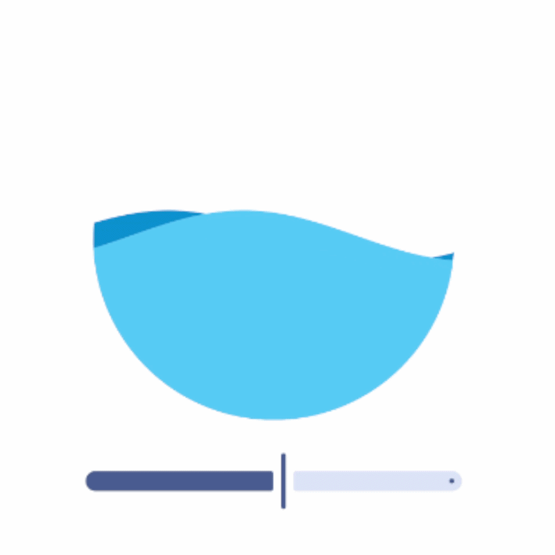

[](https://github.com/rhobus/KLoading/releases)
[](https://www.apache.org/licenses/LICENSE-2.0)
[](https://kotlinlang.org)
[](https://www.jetbrains.com/compose-multiplatform/)

# Beautiful Compose Multiplatform Loading Animations

KLoading is a **Compose Multiplatform** library offering a collection of beautiful and customizable loading animations. Easily implement loading states across **Android, iOS, Desktop, and Web**.

## 🖥️ Supported Platforms

| Platform | Support |
|:---|:---:|
| Android | ✅ |
| iOS | ✅ |
| Desktop (JVM) | ✅ |
| Web (JS) | ✅ |
| Web (Wasm) | ✅ |

## 📋 Requirements

| Requirement | Minimum version |
|:---|:---:|
| Kotlin | 2.0.0 |
| Compose Multiplatform | 1.7.0 |
| Android minSdk | 24 |

## 🚀 Installation

To integrate KLoading into your Compose Multiplatform project, add the library as a dependency in your `build.gradle.kts` file.

### 1\. Add the Dependency

In your common module's `build.gradle.kts`:

```kotlin
commonMain.dependencies {
    // Other dependencies...
    implementation("io.github.rhobus:KLoading:${latest_version}")
}
```

### 2\. Configure Repositories (If Needed)

Ensure your project has access to the Maven Central repository where the library is hosted. This is usually configured in the top-level or project-level `settings.gradle.kts` or `build.gradle.kts`.

```kotlin
repositories {
    mavenCentral()
}
```

## ✨ Animations Available

KLoading currently offers a variety of compelling animations. Each one is a `@Composable` function that can be customized with parameters like `color`, `size`, and animation duration.

| BarsWave | BricksAnimation | DotSpinner |
|:---:|:---:|:---:|
|  |  |  |
| **RotatingBricks** | **RotatingSquare** | **SonarWave** |
|  |  |  |
| **ThreeDotsWave** | **WatchRunning<br/>Animation** | **WatchTicking<br/>Animation** |
|  |  |  |
| **WaterWave<br/>Animation** | **HeartPulse<br/>Animation** | |
|  |  | |

-----

## 💻 Usage Example

All animations are regular Composable functions. Simply call them in your UI code\!

```kotlin
import androidx.compose.foundation.background
import androidx.compose.foundation.layout.Box
import androidx.compose.foundation.layout.fillMaxSize
import androidx.compose.runtime.Composable
import androidx.compose.ui.Alignment
import androidx.compose.ui.Modifier
import androidx.compose.ui.graphics.Color
import androidx.compose.ui.unit.dp
import io.github.rhobus.kloading.animation.DotSpinner

@Composable
fun LoadingScreen() {
    Box(
        modifier = Modifier
            .fillMaxSize()
            .background(Color.Black),
        contentAlignment = Alignment.Center
    ) {
        DotSpinner(
            color = Color.Yellow,
            dotSize = 10.dp,
            maxRadius = 30.dp
        )
    }
}
```

> **Note:** KLoading has no dependency on Material3. The example above uses only `foundation` and `ui` — no additional dependencies required.

-----

## 🤝 Contributing

All contributions from the community are welcome\! If you have a cool, performant loading animation you'd like to share, please check out the **[CONTRIBUTING.md](CONTRIBUTING.md)** file for guidelines on how to submit your work. Help us make KLoading the best library for loading animations\!

-----

## 📄 License

KLoading is licensed under the **Apache License, Version 2.0**. You are free to use, modify, and distribute this software, subject to the terms of the license.